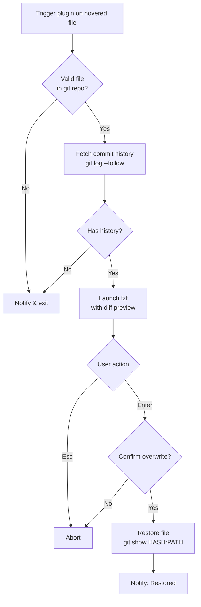

# git-time-machine.yazi

[](LICENSE)
[](https://github.com/sxyazi/yazi)

A [Yazi](https://github.com/sxyazi/yazi) plugin to restore files from git history using [fzf](https://github.com/junegunn/fzf) and [delta](https://github.com/dandavison/delta).

## Demo


## Features

- Interactive commit selection with fzf
- Live diff preview powered by delta (falls back to `git diff --color=always` if delta is not installed)
- Follows renamed files (`git log --follow`)
- Works with any file in a git repository
- Confirmation dialog before overwriting
- Cross-platform: macOS, Linux, and Windows

## Requirements

- [git](https://git-scm.com/)
- [fzf](https://github.com/junegunn/fzf)
- [delta](https://github.com/dandavison/delta) (optional — enables richer syntax-highlighted diff preview; falls back to `git diff --color=always`)

## Installation

```sh
ya pkg add masaki39/git-time-machine
```

To update:

```sh
ya pkg upgrade masaki39/git-time-machine
```

## Usage

Hover over a file in a git repository and press the keybinding. A fzf list of commits that touched the file will appear. Select a commit to preview the diff, then press Enter to restore the file to that version.

| Key | Action |
|-----|--------|
| `Enter` | Restore file from selected commit |
| `Esc` | Cancel |
| `ctrl-j` / `ctrl-k` | Move down / up |
| `ctrl-r` | Clear query |

## Configuration

Add a keybinding in `~/.config/yazi/keymap.toml`:

```toml
[[mgr.prepend_keymap]]
on  = ["g", "t"]
run = "plugin git-time-machine"
desc = "Git time machine (restore file from history)"
```

## How it works



## License

MIT
